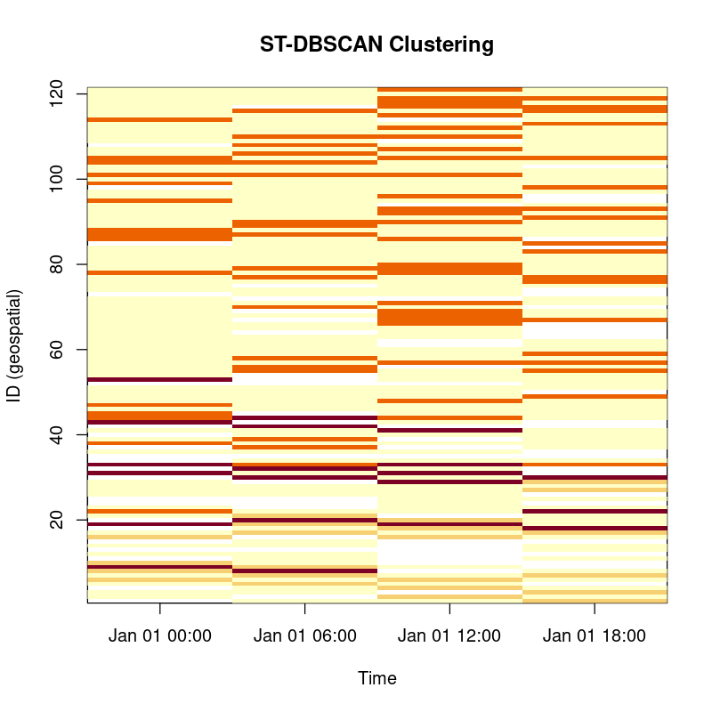
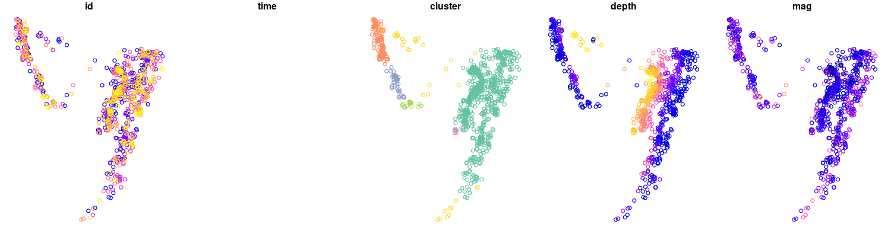
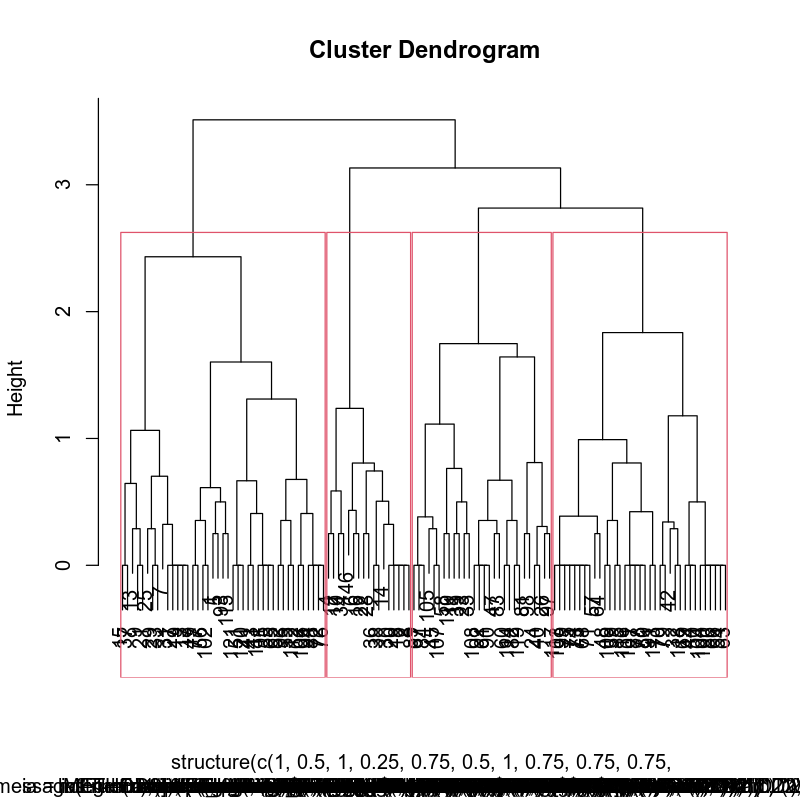
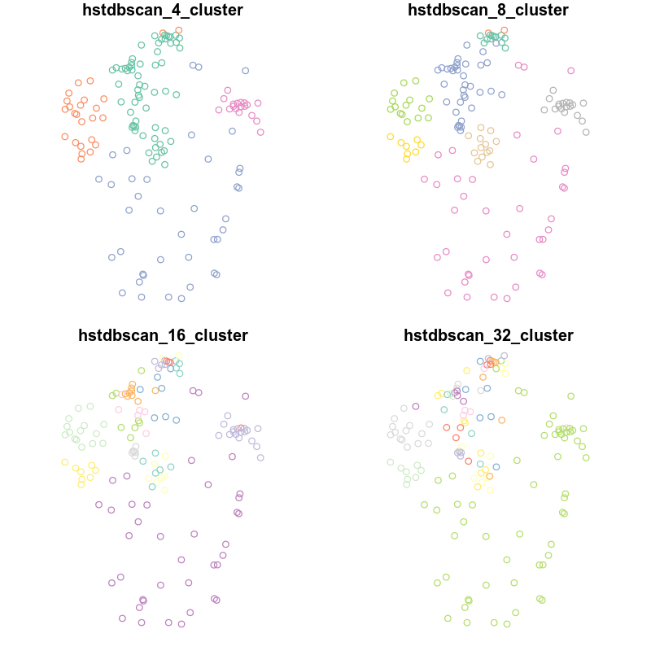
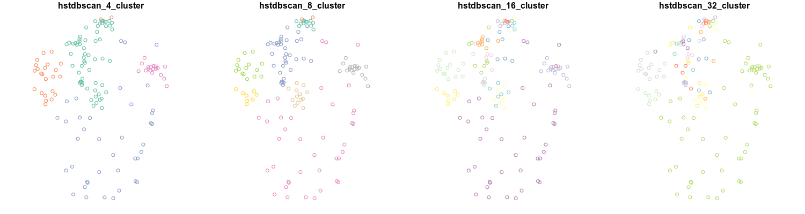
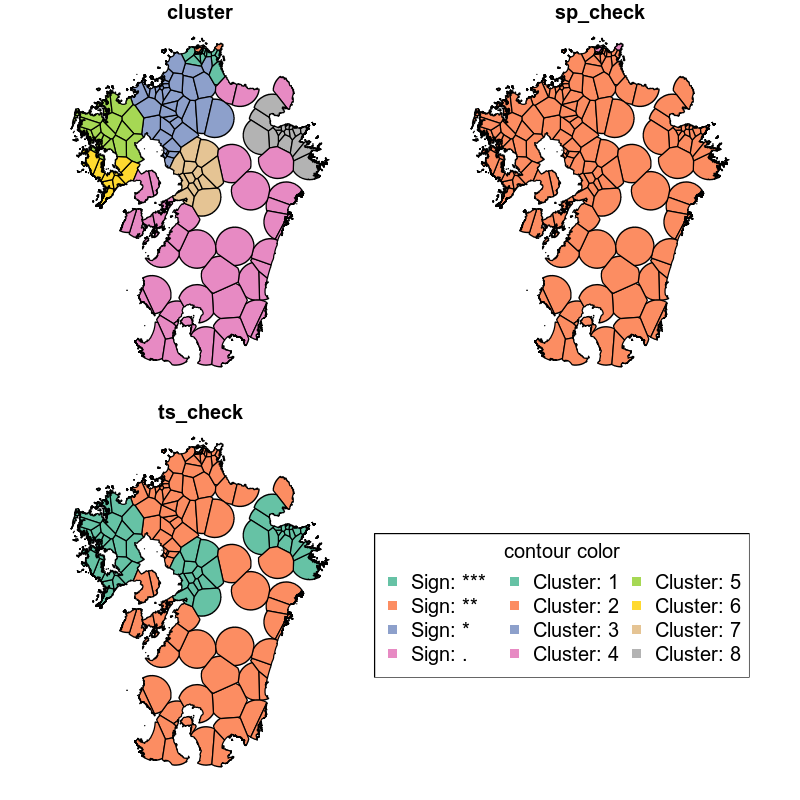

#+property: header-args:R :session *R* :exports both :results code output :eval no-export 

* GBstdbscan package.
ST-DBSCAN (density-based clustering applicable Spatio-Temporal data.) [fn:1]は密度ベースのクラスタリング手法であり、時空間データの解像度はそのままにクラスタリングを行い、ホットスポット検出など時空間データの解析に広く利用されている手法です。

* ST-DBSCANのアルゴリズム

ST-SBSCAN法のアルゴリズム[fn:1]は引用文献から引用し、 ~stdbscan~ 関数を定義しました。
また、このパッケージではグリッドデータにも対応できるよう、アルゴリズムを一部修正しています。
具体的には、クラスター認定されるためには地点 $X$ の隣接点 $Y$ の数が MinPts以上であることが条件 ( $|Y| \geqq MinPts$ ) となっていますが、グリッドデータは常に一定数の隣接点を持つことからこの条件では最適な隣接点を求めることができないと思われます。
そこで、 地点 $X$ と隣接点 $Y$ の値 $D$ の差が $\Delta \epsilon$ 以上となる条件 $Y_\epsilon = (X - Y) \geqq \Delta \epsilon$ の数が MinPts 以上となる条件 ( $|Y_\epsilon| \geqq minPts$ )に変更してクラスター判定を行うよう修正しました。

更に、ST-DBSCAN法の結果に階層的クラスタリングを適用する、階層的ST-DBSCAN (Hierarchical ST-DBSCAN) を実行する ~hstdbscan~ 関数を定義しました。
この ~hstdbscan~ は ~neighbortype = "spatial"~ であるデータに対して、効果的に階層的クラスタリングを実施できます。(~neighbortype = "random"~ では実施しても意味がありません。)

* install package
githubからインストールを実行してください。

#+begin_src R 
  devtools::install_github("IEOHS/ST-DBSCAN.R")
#+end_src

* usage
** ST-DBSCAN
*** for random data

地震の観測位置のように、位置、時間がランダムで位置情報の重複を考慮しないデータである場合、以下のようにして計算を実行します。

#+begin_src R
  library(GBstdbscan)
  lon <- runif(100, min = 130, max = 140)
  lat <- runif(100, min = 30, max = 40)
  t <- sample(as.POSIXct("2024-01-01 00:00:00", tz = "JST") + 3600 * seq(0, 23, by = 6),
              size = 100, replace = TRUE)
  x <- sf::st_as_sf(data.frame(x = lon, y = lat),
                    coords = c("x", "y"),
                    crs = 4326) |> sf::st_geometry()

  vals <- setVals("test1", abs(runif(length(x), min = 0, max = 100)), 5)
  (clust <- stdbscan(x = x, eps1 = 100, eps2 = 3600 * 6, minPts = 4,
                    vals = vals, neighbortype = "random"))

#+end_src

#+RESULTS:
#+begin_src R
===== Start ST-DBSCAN method =====

1. Calculation Neighbor List
call: spdep::dnearneigh

2. Calculation Cluster
,* Performs ST-DBSCAN calculations.

  |                                                                                                                                                        
  |                                                                                                                                                  |   0%
  |                                                                                                                                                        
  |=                                                                                                                                                 |   1%
  |                                                                                                                                                        
  |===                                                                                                                                               |   2%
  |                                                                                                                                                        
  |====                                                                                                                                              |   3%
  |                                                                                                                                                        
  |======                                                                                                                                            |   4%
  |                                                                                                                                                        
  |=======                                                                                                                                           |   5%
  |                                                                                                                                                        
  |=========                                                                                                                                         |   6%
  |                                                                                                                                                        
  |==========                                                                                                                                        |   7%
  |                                                                                                                                                        
  |============                                                                                                                                      |   8%
  |                                                                                                                                                        
  |=============                                                                                                                                     |   9%
  |                                                                                                                                                        
  |===============                                                                                                                                   |  10%
  |                                                                                                                                                        
  |================                                                                                                                                  |  11%
  |                                                                                                                                                        
  |==================                                                                                                                                |  12%
  |                                                                                                                                                        
  |===================                                                                                                                               |  13%
  |                                                                                                                                                        
  |====================                                                                                                                              |  14%
  |                                                                                                                                                        
  |======================                                                                                                                            |  15%
  |                                                                                                                                                        
  |=======================                                                                                                                           |  16%
  |                                                                                                                                                        
  |=========================                                                                                                                         |  17%
  |                                                                                                                                                        
  |==========================                                                                                                                        |  18%
  |                                                                                                                                                        
  |============================                                                                                                                      |  19%
  |                                                                                                                                                        
  |=============================                                                                                                                     |  20%
  |                                                                                                                                                        
  |===============================                                                                                                                   |  21%
  |                                                                                                                                                        
  |================================                                                                                                                  |  22%
  |                                                                                                                                                        
  |==================================                                                                                                                |  23%
  |                                                                                                                                                        
  |===================================                                                                                                               |  24%
  |                                                                                                                                                        
  |====================================                                                                                                              |  25%
  |                                                                                                                                                        
  |======================================                                                                                                            |  26%
  |                                                                                                                                                        
  |=======================================                                                                                                           |  27%
  |                                                                                                                                                        
  |=========================================                                                                                                         |  28%
  |                                                                                                                                                        
  |==========================================                                                                                                        |  29%
  |                                                                                                                                                        
  |============================================                                                                                                      |  30%
  |                                                                                                                                                        
  |=============================================                                                                                                     |  31%
  |                                                                                                                                                        
  |===============================================                                                                                                   |  32%
  |                                                                                                                                                        
  |================================================                                                                                                  |  33%
  |                                                                                                                                                        
  |==================================================                                                                                                |  34%
  |                                                                                                                                                        
  |===================================================                                                                                               |  35%
  |                                                                                                                                                        
  |=====================================================                                                                                             |  36%
  |                                                                                                                                                        
  |======================================================                                                                                            |  37%
  |                                                                                                                                                        
  |=======================================================                                                                                           |  38%
  |                                                                                                                                                        
  |=========================================================                                                                                         |  39%
  |                                                                                                                                                        
  |==========================================================                                                                                        |  40%
  |                                                                                                                                                        
  |============================================================                                                                                      |  41%
  |                                                                                                                                                        
  |=============================================================                                                                                     |  42%
  |                                                                                                                                                        
  |===============================================================                                                                                   |  43%
  |                                                                                                                                                        
  |================================================================                                                                                  |  44%
  |                                                                                                                                                        
  |==================================================================                                                                                |  45%
  |                                                                                                                                                        
  |===================================================================                                                                               |  46%
  |                                                                                                                                                        
  |=====================================================================                                                                             |  47%
  |                                                                                                                                                        
  |======================================================================                                                                            |  48%
  |                                                                                                                                                        
  |========================================================================                                                                          |  49%
  |                                                                                                                                                        
  |=========================================================================                                                                         |  50%
  |                                                                                                                                                        
  |==========================================================================                                                                        |  51%
  |                                                                                                                                                        
  |============================================================================                                                                      |  52%
  |                                                                                                                                                        
  |=============================================================================                                                                     |  53%
  |                                                                                                                                                        
  |===============================================================================                                                                   |  54%
  |                                                                                                                                                        
  |================================================================================                                                                  |  55%
  |                                                                                                                                                        
  |==================================================================================                                                                |  56%
  |                                                                                                                                                        
  |===================================================================================                                                               |  57%
  |                                                                                                                                                        
  |=====================================================================================                                                             |  58%
  |                                                                                                                                                        
  |======================================================================================                                                            |  59%
  |                                                                                                                                                        
  |========================================================================================                                                          |  60%
  |                                                                                                                                                        
  |=========================================================================================                                                         |  61%
  |                                                                                                                                                        
  |===========================================================================================                                                       |  62%
  |                                                                                                                                                        
  |============================================================================================                                                      |  63%
  |                                                                                                                                                        
  |=============================================================================================                                                     |  64%
  |                                                                                                                                                        
  |===============================================================================================                                                   |  65%
  |                                                                                                                                                        
  |================================================================================================                                                  |  66%
  |                                                                                                                                                        
  |==================================================================================================                                                |  67%
  |                                                                                                                                                        
  |===================================================================================================                                               |  68%
  |                                                                                                                                                        
  |=====================================================================================================                                             |  69%
  |                                                                                                                                                        
  |======================================================================================================                                            |  70%
  |                                                                                                                                                        
  |========================================================================================================                                          |  71%
  |                                                                                                                                                        
  |=========================================================================================================                                         |  72%
  |                                                                                                                                                        
  |===========================================================================================================                                       |  73%
  |                                                                                                                                                        
  |============================================================================================================                                      |  74%
  |                                                                                                                                                        
  |==============================================================================================================                                    |  75%
  |                                                                                                                                                        
  |===============================================================================================================                                   |  76%
  |                                                                                                                                                        
  |================================================================================================================                                  |  77%
  |                                                                                                                                                        
  |==================================================================================================================                                |  78%
  |                                                                                                                                                        
  |===================================================================================================================                               |  79%
  |                                                                                                                                                        
  |=====================================================================================================================                             |  80%
  |                                                                                                                                                        
  |======================================================================================================================                            |  81%
  |                                                                                                                                                        
  |========================================================================================================================                          |  82%
  |                                                                                                                                                        
  |=========================================================================================================================                         |  83%
  |                                                                                                                                                        
  |===========================================================================================================================                       |  84%
  |                                                                                                                                                        
  |============================================================================================================================                      |  85%
  |                                                                                                                                                        
  |==============================================================================================================================                    |  86%
  |                                                                                                                                                        
  |===============================================================================================================================                   |  87%
  |                                                                                                                                                        
  |================================================================================================================================                  |  88%
  |                                                                                                                                                        
  |==================================================================================================================================                |  89%
  |                                                                                                                                                        
  |===================================================================================================================================               |  90%
  |                                                                                                                                                        
  |=====================================================================================================================================             |  91%
  |                                                                                                                                                        
  |======================================================================================================================================            |  92%
  |                                                                                                                                                        
  |========================================================================================================================================          |  93%
  |                                                                                                                                                        
  |=========================================================================================================================================         |  94%
  |                                                                                                                                                        
  |===========================================================================================================================================       |  95%
  |                                                                                                                                                        
  |============================================================================================================================================      |  96%
  |                                                                                                                                                        
  |==============================================================================================================================================    |  97%
  |                                                                                                                                                        
  |===============================================================================================================================================   |  98%
  |                                                                                                                                                        
  |================================================================================================================================================= |  99%
  |                                                                                                                                                        
  |==================================================================================================================================================| 100%

Completed.
ST-DBSCAN clustering for 100 objects, 0 time length.
Parameters: eps1 = 100, eps2 = 21600, minPts = 4
Using geo(spdep::dnearneigh) distances, neighbor's metric = random, ST-DBSCAN type = default
The clustering contains 4 cluster(s) and 62 noise points.
===== stdbscan raw data =====
name: test1, Δeps: 5, data: 
 num [1:100] 58.6 62.8 65.7 40.4 39.5 ...

警告メッセージ:
(function (x, d1, d2, row.names = NULL, longlat = NULL, bounds = c("GE",  で:
  neighbour object has 19 sub-graphs
#+end_src

*** for spatial data
気象観測データ、シミュレーション等の格子モデルの結果など、位置情報が時間で変化しないデータを利用する場合、以下のように実行します。

#+begin_src R
  lon <- seq(130, 140, by = 1)
  lat <- seq(30, 40, by = 1)
  t <- as.POSIXct("2024-01-01 00:00:00", tz = "JST") + 3600 * seq(0, 23, by = 6)
  x <- sf::st_as_sf(expand.grid(lon, lat),
                 coords = c("Var1", "Var2"), crs = 4326) |>
    sf::st_geometry()
  vals <- setVals("test1", runif(length(x) * length(t), min = 0, max = 100), 20)
  (clust <- stdbscan(x = x, time = t, eps1 = 144, eps2 = 3600 * 6, minPts = 4,
                    vals = vals, neighbortype = "spatial"))

#+end_src

#+RESULTS:
#+begin_src R
===== Start ST-DBSCAN method =====

1. Calculation Neighbor List
call: spdep::dnearneigh

2. Calculation Cluster
,* Performs ST-DBSCAN calculations.

  |                                                                                                                                                        
  |                                                                                                                                                  |   0%
  |                                                                                                                                                        
  |=                                                                                                                                                 |   0%
  |                                                                                                                                                        
  |=                                                                                                                                                 |   1%
  |                                                                                                                                                        
  |==                                                                                                                                                |   1%
  |                                                                                                                                                        
  |==                                                                                                                                                |   2%
  |                                                                                                                                                        
  |===                                                                                                                                               |   2%
  |                                                                                                                                                        
  |====                                                                                                                                              |   2%
  |                                                                                                                                                        
  |====                                                                                                                                              |   3%
  |                                                                                                                                                        
  |=====                                                                                                                                             |   3%
  |                                                                                                                                                        
  |=====                                                                                                                                             |   4%
  |                                                                                                                                                        
  |======                                                                                                                                            |   4%
  |                                                                                                                                                        
  |=======                                                                                                                                           |   5%
  |                                                                                                                                                        
  |========                                                                                                                                          |   5%
  |                                                                                                                                                        
  |========                                                                                                                                          |   6%
  |                                                                                                                                                        
  |=========                                                                                                                                         |   6%
  |                                                                                                                                                        
  |==========                                                                                                                                        |   7%
  |                                                                                                                                                        
  |===========                                                                                                                                       |   7%
  |                                                                                                                                                        
  |===========                                                                                                                                       |   8%
  |                                                                                                                                                        
  |============                                                                                                                                      |   8%
  |                                                                                                                                                        
  |=============                                                                                                                                     |   9%
  |                                                                                                                                                        
  |==============                                                                                                                                    |   9%
  |                                                                                                                                                        
  |==============                                                                                                                                    |  10%
  |                                                                                                                                                        
  |===============                                                                                                                                   |  10%
  |                                                                                                                                                        
  |===============                                                                                                                                   |  11%
  |                                                                                                                                                        
  |================                                                                                                                                  |  11%
  |                                                                                                                                                        
  |=================                                                                                                                                 |  11%
  |                                                                                                                                                        
  |=================                                                                                                                                 |  12%
  |                                                                                                                                                        
  |==================                                                                                                                                |  12%
  |                                                                                                                                                        
  |==================                                                                                                                                |  13%
  |                                                                                                                                                        
  |===================                                                                                                                               |  13%
  |                                                                                                                                                        
  |====================                                                                                                                              |  13%
  |                                                                                                                                                        
  |====================                                                                                                                              |  14%
  |                                                                                                                                                        
  |=====================                                                                                                                             |  14%
  |                                                                                                                                                        
  |=====================                                                                                                                             |  15%
  |                                                                                                                                                        
  |======================                                                                                                                            |  15%
  |                                                                                                                                                        
  |=======================                                                                                                                           |  15%
  |                                                                                                                                                        
  |=======================                                                                                                                           |  16%
  |                                                                                                                                                        
  |========================                                                                                                                          |  16%
  |                                                                                                                                                        
  |========================                                                                                                                          |  17%
  |                                                                                                                                                        
  |=========================                                                                                                                         |  17%
  |                                                                                                                                                        
  |==========================                                                                                                                        |  18%
  |                                                                                                                                                        
  |===========================                                                                                                                       |  18%
  |                                                                                                                                                        
  |===========================                                                                                                                       |  19%
  |                                                                                                                                                        
  |============================                                                                                                                      |  19%
  |                                                                                                                                                        
  |=============================                                                                                                                     |  20%
  |                                                                                                                                                        
  |==============================                                                                                                                    |  20%
  |                                                                                                                                                        
  |==============================                                                                                                                    |  21%
  |                                                                                                                                                        
  |===============================                                                                                                                   |  21%
  |                                                                                                                                                        
  |================================                                                                                                                  |  22%
  |                                                                                                                                                        
  |=================================                                                                                                                 |  22%
  |                                                                                                                                                        
  |=================================                                                                                                                 |  23%
  |                                                                                                                                                        
  |==================================                                                                                                                |  23%
  |                                                                                                                                                        
  |==================================                                                                                                                |  24%
  |                                                                                                                                                        
  |===================================                                                                                                               |  24%
  |                                                                                                                                                        
  |====================================                                                                                                              |  24%
  |                                                                                                                                                        
  |====================================                                                                                                              |  25%
  |                                                                                                                                                        
  |=====================================                                                                                                             |  25%
  |                                                                                                                                                        
  |=====================================                                                                                                             |  26%
  |                                                                                                                                                        
  |======================================                                                                                                            |  26%
  |                                                                                                                                                        
  |=======================================                                                                                                           |  26%
  |                                                                                                                                                        
  |=======================================                                                                                                           |  27%
  |                                                                                                                                                        
  |========================================                                                                                                          |  27%
  |                                                                                                                                                        
  |========================================                                                                                                          |  28%
  |                                                                                                                                                        
  |=========================================                                                                                                         |  28%
  |                                                                                                                                                        
  |==========================================                                                                                                        |  29%
  |                                                                                                                                                        
  |===========================================                                                                                                       |  29%
  |                                                                                                                                                        
  |===========================================                                                                                                       |  30%
  |                                                                                                                                                        
  |============================================                                                                                                      |  30%
  |                                                                                                                                                        
  |=============================================                                                                                                     |  31%
  |                                                                                                                                                        
  |==============================================                                                                                                    |  31%
  |                                                                                                                                                        
  |==============================================                                                                                                    |  32%
  |                                                                                                                                                        
  |===============================================                                                                                                   |  32%
  |                                                                                                                                                        
  |================================================                                                                                                  |  33%
  |                                                                                                                                                        
  |=================================================                                                                                                 |  33%
  |                                                                                                                                                        
  |=================================================                                                                                                 |  34%
  |                                                                                                                                                        
  |==================================================                                                                                                |  34%
  |                                                                                                                                                        
  |==================================================                                                                                                |  35%
  |                                                                                                                                                        
  |===================================================                                                                                               |  35%
  |                                                                                                                                                        
  |====================================================                                                                                              |  35%
  |                                                                                                                                                        
  |====================================================                                                                                              |  36%
  |                                                                                                                                                        
  |=====================================================                                                                                             |  36%
  |                                                                                                                                                        
  |=====================================================                                                                                             |  37%
  |                                                                                                                                                        
  |======================================================                                                                                            |  37%
  |                                                                                                                                                        
  |=======================================================                                                                                           |  37%
  |                                                                                                                                                        
  |=======================================================                                                                                           |  38%
  |                                                                                                                                                        
  |========================================================                                                                                          |  38%
  |                                                                                                                                                        
  |========================================================                                                                                          |  39%
  |                                                                                                                                                        
  |=========================================================                                                                                         |  39%
  |                                                                                                                                                        
  |==========================================================                                                                                        |  39%
  |                                                                                                                                                        
  |==========================================================                                                                                        |  40%
  |                                                                                                                                                        
  |===========================================================                                                                                       |  40%
  |                                                                                                                                                        
  |===========================================================                                                                                       |  41%
  |                                                                                                                                                        
  |============================================================                                                                                      |  41%
  |                                                                                                                                                        
  |=============================================================                                                                                     |  42%
  |                                                                                                                                                        
  |==============================================================                                                                                    |  42%
  |                                                                                                                                                        
  |==============================================================                                                                                    |  43%
  |                                                                                                                                                        
  |===============================================================                                                                                   |  43%
  |                                                                                                                                                        
  |================================================================                                                                                  |  44%
  |                                                                                                                                                        
  |=================================================================                                                                                 |  44%
  |                                                                                                                                                        
  |=================================================================                                                                                 |  45%
  |                                                                                                                                                        
  |==================================================================                                                                                |  45%
  |                                                                                                                                                        
  |===================================================================                                                                               |  46%
  |                                                                                                                                                        
  |====================================================================                                                                              |  46%
  |                                                                                                                                                        
  |====================================================================                                                                              |  47%
  |                                                                                                                                                        
  |=====================================================================                                                                             |  47%
  |                                                                                                                                                        
  |=====================================================================                                                                             |  48%
  |                                                                                                                                                        
  |======================================================================                                                                            |  48%
  |                                                                                                                                                        
  |=======================================================================                                                                           |  48%
  |                                                                                                                                                        
  |=======================================================================                                                                           |  49%
  |                                                                                                                                                        
  |========================================================================                                                                          |  49%
  |                                                                                                                                                        
  |========================================================================                                                                          |  50%
  |                                                                                                                                                        
  |=========================================================================                                                                         |  50%
  |                                                                                                                                                        
  |==========================================================================                                                                        |  50%
  |                                                                                                                                                        
  |==========================================================================                                                                        |  51%
  |                                                                                                                                                        
  |===========================================================================                                                                       |  51%
  |                                                                                                                                                        
  |===========================================================================                                                                       |  52%
  |                                                                                                                                                        
  |============================================================================                                                                      |  52%
  |                                                                                                                                                        
  |=============================================================================                                                                     |  52%
  |                                                                                                                                                        
  |=============================================================================                                                                     |  53%
  |                                                                                                                                                        
  |==============================================================================                                                                    |  53%
  |                                                                                                                                                        
  |==============================================================================                                                                    |  54%
  |                                                                                                                                                        
  |===============================================================================                                                                   |  54%
  |                                                                                                                                                        
  |================================================================================                                                                  |  55%
  |                                                                                                                                                        
  |=================================================================================                                                                 |  55%
  |                                                                                                                                                        
  |=================================================================================                                                                 |  56%
  |                                                                                                                                                        
  |==================================================================================                                                                |  56%
  |                                                                                                                                                        
  |===================================================================================                                                               |  57%
  |                                                                                                                                                        
  |====================================================================================                                                              |  57%
  |                                                                                                                                                        
  |====================================================================================                                                              |  58%
  |                                                                                                                                                        
  |=====================================================================================                                                             |  58%
  |                                                                                                                                                        
  |======================================================================================                                                            |  59%
  |                                                                                                                                                        
  |=======================================================================================                                                           |  59%
  |                                                                                                                                                        
  |=======================================================================================                                                           |  60%
  |                                                                                                                                                        
  |========================================================================================                                                          |  60%
  |                                                                                                                                                        
  |========================================================================================                                                          |  61%
  |                                                                                                                                                        
  |=========================================================================================                                                         |  61%
  |                                                                                                                                                        
  |==========================================================================================                                                        |  61%
  |                                                                                                                                                        
  |==========================================================================================                                                        |  62%
  |                                                                                                                                                        
  |===========================================================================================                                                       |  62%
  |                                                                                                                                                        
  |===========================================================================================                                                       |  63%
  |                                                                                                                                                        
  |============================================================================================                                                      |  63%
  |                                                                                                                                                        
  |=============================================================================================                                                     |  63%
  |                                                                                                                                                        
  |=============================================================================================                                                     |  64%
  |                                                                                                                                                        
  |==============================================================================================                                                    |  64%
  |                                                                                                                                                        
  |==============================================================================================                                                    |  65%
  |                                                                                                                                                        
  |===============================================================================================                                                   |  65%
  |                                                                                                                                                        
  |================================================================================================                                                  |  65%
  |                                                                                                                                                        
  |================================================================================================                                                  |  66%
  |                                                                                                                                                        
  |=================================================================================================                                                 |  66%
  |                                                                                                                                                        
  |=================================================================================================                                                 |  67%
  |                                                                                                                                                        
  |==================================================================================================                                                |  67%
  |                                                                                                                                                        
  |===================================================================================================                                               |  68%
  |                                                                                                                                                        
  |====================================================================================================                                              |  68%
  |                                                                                                                                                        
  |====================================================================================================                                              |  69%
  |                                                                                                                                                        
  |=====================================================================================================                                             |  69%
  |                                                                                                                                                        
  |======================================================================================================                                            |  70%
  |                                                                                                                                                        
  |=======================================================================================================                                           |  70%
  |                                                                                                                                                        
  |=======================================================================================================                                           |  71%
  |                                                                                                                                                        
  |========================================================================================================                                          |  71%
  |                                                                                                                                                        
  |=========================================================================================================                                         |  72%
  |                                                                                                                                                        
  |==========================================================================================================                                        |  72%
  |                                                                                                                                                        
  |==========================================================================================================                                        |  73%
  |                                                                                                                                                        
  |===========================================================================================================                                       |  73%
  |                                                                                                                                                        
  |===========================================================================================================                                       |  74%
  |                                                                                                                                                        
  |============================================================================================================                                      |  74%
  |                                                                                                                                                        
  |=============================================================================================================                                     |  74%
  |                                                                                                                                                        
  |=============================================================================================================                                     |  75%
  |                                                                                                                                                        
  |==============================================================================================================                                    |  75%
  |                                                                                                                                                        
  |==============================================================================================================                                    |  76%
  |                                                                                                                                                        
  |===============================================================================================================                                   |  76%
  |                                                                                                                                                        
  |================================================================================================================                                  |  76%
  |                                                                                                                                                        
  |================================================================================================================                                  |  77%
  |                                                                                                                                                        
  |=================================================================================================================                                 |  77%
  |                                                                                                                                                        
  |=================================================================================================================                                 |  78%
  |                                                                                                                                                        
  |==================================================================================================================                                |  78%
  |                                                                                                                                                        
  |===================================================================================================================                               |  79%
  |                                                                                                                                                        
  |====================================================================================================================                              |  79%
  |                                                                                                                                                        
  |====================================================================================================================                              |  80%
  |                                                                                                                                                        
  |=====================================================================================================================                             |  80%
  |                                                                                                                                                        
  |======================================================================================================================                            |  81%
  |                                                                                                                                                        
  |=======================================================================================================================                           |  81%
  |                                                                                                                                                        
  |=======================================================================================================================                           |  82%
  |                                                                                                                                                        
  |========================================================================================================================                          |  82%
  |                                                                                                                                                        
  |=========================================================================================================================                         |  83%
  |                                                                                                                                                        
  |==========================================================================================================================                        |  83%
  |                                                                                                                                                        
  |==========================================================================================================================                        |  84%
  |                                                                                                                                                        
  |===========================================================================================================================                       |  84%
  |                                                                                                                                                        
  |===========================================================================================================================                       |  85%
  |                                                                                                                                                        
  |============================================================================================================================                      |  85%
  |                                                                                                                                                        
  |=============================================================================================================================                     |  85%
  |                                                                                                                                                        
  |=============================================================================================================================                     |  86%
  |                                                                                                                                                        
  |==============================================================================================================================                    |  86%
  |                                                                                                                                                        
  |==============================================================================================================================                    |  87%
  |                                                                                                                                                        
  |===============================================================================================================================                   |  87%
  |                                                                                                                                                        
  |================================================================================================================================                  |  87%
  |                                                                                                                                                        
  |================================================================================================================================                  |  88%
  |                                                                                                                                                        
  |=================================================================================================================================                 |  88%
  |                                                                                                                                                        
  |=================================================================================================================================                 |  89%
  |                                                                                                                                                        
  |==================================================================================================================================                |  89%
  |                                                                                                                                                        
  |===================================================================================================================================               |  89%
  |                                                                                                                                                        
  |===================================================================================================================================               |  90%
  |                                                                                                                                                        
  |====================================================================================================================================              |  90%
  |                                                                                                                                                        
  |====================================================================================================================================              |  91%
  |                                                                                                                                                        
  |=====================================================================================================================================             |  91%
  |                                                                                                                                                        
  |======================================================================================================================================            |  92%
  |                                                                                                                                                        
  |=======================================================================================================================================           |  92%
  |                                                                                                                                                        
  |=======================================================================================================================================           |  93%
  |                                                                                                                                                        
  |========================================================================================================================================          |  93%
  |                                                                                                                                                        
  |=========================================================================================================================================         |  94%
  |                                                                                                                                                        
  |==========================================================================================================================================        |  94%
  |                                                                                                                                                        
  |==========================================================================================================================================        |  95%
  |                                                                                                                                                        
  |===========================================================================================================================================       |  95%
  |                                                                                                                                                        
  |============================================================================================================================================      |  96%
  |                                                                                                                                                        
  |=============================================================================================================================================     |  96%
  |                                                                                                                                                        
  |=============================================================================================================================================     |  97%
  |                                                                                                                                                        
  |==============================================================================================================================================    |  97%
  |                                                                                                                                                        
  |==============================================================================================================================================    |  98%
  |                                                                                                                                                        
  |===============================================================================================================================================   |  98%
  |                                                                                                                                                        
  |================================================================================================================================================  |  98%
  |                                                                                                                                                        
  |================================================================================================================================================  |  99%
  |                                                                                                                                                        
  |================================================================================================================================================= |  99%
  |                                                                                                                                                        
  |================================================================================================================================================= | 100%
  |                                                                                                                                                        
  |==================================================================================================================================================| 100%

Completed.
ST-DBSCAN clustering for 484 objects, 4 time length.
Parameters: eps1 = 144, eps2 = 21600, minPts = 4
Using geo(spdep::dnearneigh) distances, neighbor's metric = spatial, ST-DBSCAN type = grid
The clustering contains 4 cluster(s) and 87 noise points.
===== stdbscan raw data =====
name: test1, Δeps: 20, data: 
 num [1:484] 64.9 46.1 35.3 98.9 26.1 ...
#+end_src

*** plot

~stdbscan~ 関数の結果オブジェクトを ~plot~ すると、クラスターラベルで色分けされた結果を見ることができます。
#+name: code:plot-stdbscan
#+begin_src R :results file graphics :file "./inst/plot-stdbscan.png" :width 800 :height 800 :exports both :res 120
plot(clust)
#+end_src

#+name: fig:plot-stdbscan
#+attr_html: :width 500px
#+RESULTS: code:plot-stdbscan

*** clustering for `quakes` data

Rの *quakes* データセットを使ったST-DBSCANクラスタリングをテストします。
条件として、地震の発生深さ (depth) とマグニチュード (mag) を指定しています。

#+begin_src R
  library(GBstdbscan)
  quakes_data <- sf::st_as_sf(quakes, coords = c("long", "lat"), crs = 4326)
  clust <- stdbscan(x = sf::st_geometry(quakes_data),
                    eps1 = 100, minPts = 6,
                    vals = setVals("depth", quakes_data$depth, 150,
                                   "mag", quakes_data$mag, 2),
                    neighbortype = "random")
  print(clust)
#+end_src

#+RESULTS:
#+begin_src R
===== Start ST-DBSCAN method =====

1. Calculation Neighbor List
call: spdep::dnearneigh

2. Calculation Cluster
,* Performs ST-DBSCAN calculations.
|=================================================================================================================================================| 100%

Completed.
警告メッセージ:
(function (x, d1, d2, row.names = NULL, longlat = NULL, bounds = c("GE",  で:
  neighbour object has 17 sub-graphs
ST-DBSCAN clustering for 1000 objects, 0 time length.
Parameters: eps1 = 100, eps2 = , minPts = 6
Using geo(spdep::dnearneigh) distances, neighbor's metric = random, ST-DBSCAN type = default
The clustering contains 5 cluster(s) and 37 noise points.
===== stdbscan raw data =====
name: depth, Δeps: 150, data: 
 int [1:1000] 562 650 42 626 649 195 82 194 211 622 ...

===== stdbscan raw data =====
name: mag, Δeps: 2, data: 
 num [1:1000] 4.8 4.2 5.4 4.1 4 4 4.8 4.4 4.7 4.3 ...
#+end_src

#+name: code:quakes-plot-stdbscan
#+begin_src R :results file graphics :file "./inst/quakes-plot-stdbscan.png" :width 1500 :height 400 :exports both :res 120
  with(clust$results, {
    merge(geo, value, by = "id") |> plot()
  })
#+end_src

#+name: fig:quakes-plot-stdbscan
#+attr_html: :width 1000px
#+RESULTS: code:quakes-plot-stdbscan

** Hierarchical ST-DBSCAN

階層的クラスタリングを追加で実行する場合は、 ~hstdbscan~ 関数を利用します。

#+begin_src R
  library(GBstdbscan)
  lon <- seq(130, 140, by = 1)
  lat <- seq(30, 40, by = 1)
  t <- as.POSIXct("2024-01-01 00:00:00", tz = "JST") + 3600 * seq(0, 23, by = 6)
  x <- sf::st_as_sf(expand.grid(lon, lat),
                 coords = c("Var1", "Var2"), crs = 4326) |>
    sf::st_geometry()
  vals <- setVals("test1", runif(length(x) * length(t), min = 0, max = 100), 20)
  (clust <- hstdbscan(x = x, time = t, eps1 = 144, eps2 = 3600 * 6, minPts = 6,
                     vals = vals, neighbortype = "spatial"))
#+end_src

#+RESULTS:
#+begin_src R
===== Start ST-DBSCAN method =====

1. Calculation Neighbor List
call: spdep::dnearneigh

2. Calculation Cluster
,* Performs ST-DBSCAN calculations.
|=============================================================================================| 100%

Completed.
Hierarchical ST-DBSCAN clustering for 484 objects, 4 time length.
Parameters: eps1 = 144, eps2 = 21600, minPts = 6
Using geo(spdep::dnearneigh) distances, neighbor's metric = spatial, ST-DBSCAN type = grid
The clustering contains 3 cluster(s) and 71 noise points.
===== stdbscan raw data =====
name: test1, Δeps: 20, data: 
 num [1:484] 21.1 23.3 52.1 11.6 63.7 ...

Can use the `cutclust` function to split it into `k` clusters
#+end_src

*** plot

~hstdbscan~ 関数の結果には ~hclust~ によるツリーが含まれており、以下の通り図に出力することができます。

#+name: code:plot-hstdbscan
#+begin_src R :results file graphics :file "./inst/plot-hstdbscan.png" :width 800 :height 800 :exports both :res 120
  plot(clust)
  rect_hstdbscan(clust, k = 4)
#+end_src

#+name: fig:plot-hstdbscan
#+attr_html: :width 500px
#+RESULTS: code:plot-hstdbscan

*** get clustering data

クラスタリングの結果を =k= 数で分割する場合、 ~cutclust~ 関数を利用して出力します。

#+begin_src R
  cutclust(clust, k = 4)
#+end_src

#+RESULTS:
#+begin_src R
Simple feature collection with 121 features and 2 fields
Geometry type: POINT
Dimension:     XY
Bounding box:  xmin: 130 ymin: 30 xmax: 140 ymax: 40
Geodetic CRS:  WGS 84
First 10 features:
   cluster id       geometry
1        1  1 POINT (130 30)
2        2  2 POINT (131 30)
3        1  3 POINT (132 30)
4        2  4 POINT (133 30)
5        1  5 POINT (134 30)
6        2  6 POINT (135 30)
7        1  7 POINT (136 30)
8        2  8 POINT (137 30)
9        1  9 POINT (138 30)
10       2 10 POINT (139 30)
#+end_src

** Methods for evaluating clustering results

クラスタリングの結果を評価する方法として、シルエットスコアなどの指針値が利用されています。

一方で、時間・空間属性を持つデータのクラスタリングでは、時系列類似性と空間的集塊性が重要な意味を持つことがあります。

一対の時系列データに関する時系列類似性は、R^{2}値やRMSEなどの統計的手法で類似度を確認することができますが、3つ以上の時系列データの場合はこれらの方法をそのまま利用することはできません。
そのため、 ~stdbscan~ パッケージでは動的因子モデル (DFM) で複数の時系列データから因子を抽出し、その因子との類似性を確認することで、時系列類似性の評価を行っています (~sparseDFM~ package)。

空間的集塊性の評価には一般に ~Moran's I Statics~ が利用されています。
~Moran's I Statics~ では空間的なデータのばらつきを評価するため、空間的集塊性を定量化することができます。
~stdbscan~ パッケージでは ~Join-Count Statistics~ を利用しています (~spdep~ package)。

*** Creating Map Data with Adjacent Points

デモデータとして、2019年度の九州地方の一部 (福岡県、佐賀県、長崎県、熊本県、大分県、宮崎県、鹿児島県) の光化学オキシダント濃度データ[fn:2] と国土数値情報の地図データ[fn:3] を改変して利用しています。

#+begin_src R
  library(GBstdbscan)
  data("oxdata", package = "GBstdbscan")
  str(oxdata, 2)
#+end_src

#+RESULTS:
#+begin_src R
List of 2
 $ data: int [1:143, 1:2183] 47 50 NA 52 56 NA 49 45 47 51 ...
  ..- attr(*, "dimnames")=List of 2
 $ geo :List of 2
  ..$ gov_map    :Classes ‘sf’ and 'data.frame':	7 obs. of  2 variables:
  .. ..- attr(*, "sf_column")= chr "geometry"
  .. ..- attr(*, "agr")= Factor w/ 3 levels "constant","aggregate",..: NA
  .. .. ..- attr(*, "names")= chr "id"
  ..$ predict_map:Classes ‘sf’ and 'data.frame':	143 obs. of  4 variables:
  .. ..- attr(*, "sf_column")= chr "geometry"
  .. ..- attr(*, "agr")= Factor w/ 3 levels "constant","aggregate",..: NA NA NA
  .. .. ..- attr(*, "names")= chr [1:3] "id" "name" "pref"
#+end_src

隣接点情報を持つ地図を作成します。

#+name: code:plot-oxmap
#+begin_src R :results file graphics :file "./inst/plot-oxmap.png" :width 800 :height 800 :exports both :res 120 :async yes 
  oxmap <- createBufferMap(geo = sf::st_geometry(oxdata$geo$predict_map),
                           voronoi = TRUE, buffer = TRUE, dist = 18100,
                           coast = TRUE, coastline = sf::st_union(oxdata$geo$gov_map))
  plot(oxmap)
#+end_src

#+name: fig:plot-oxmap
#+attr_html: :width 500px
#+RESULTS: code:plot-oxmap

*** Run Clustering

~hstdbscan~ で位置情報クラスターを作成します。
~geostclust~ 関数ではクラスターの分割数を ~cuts~ 引数で複数指定することができ、今回は ~k = 4, 8, 16, 32~ の分割数に設定しています。

#+begin_src R :async yes 
  (clust <- geostclust(geo = sf::st_geometry(oxdata$geo$predict_map),
                      times = as.POSIXct(paste0(gsub("_", "", colnames(oxdata$data)[720:767]), ":00:00")),
                      cuts = c(4, 8, 16, 32),
                      method = "hstdbscan",
                      eps1 = 18.1, eps2 = 3600, minPts = 6,
                      vals = setVals("ox", oxdata$data[, 720:767], 20)))
#+end_src

#+RESULTS:
#+begin_src none
===== Start ST-DBSCAN method =====

1. Calculation Neighbor List
call: spdep::dnearneigh

2. Calculation Cluster
,* Performs ST-DBSCAN calculations.
  |==============================================================================================| 100%

Completed.
$cluster
Simple feature collection with 143 features and 4 fields
Geometry type: POINT
Dimension:     XY
Bounding box:  xmin: 129.6656 ymin: 31.36222 xmax: 131.9042 ymax: 33.94806
Geodetic CRS:  WGS 84
First 10 features:
   hstdbscan_4_cluster hstdbscan_8_cluster hstdbscan_16_cluster hstdbscan_32_cluster
1                    1                   1                    1                    1
2                    1                   1                    1                    2
3                    2                   2                    2                    3
4                    1                   1                    3                    4
5                    1                   1                    3                    5
6                    2                   2                    2                    3
7                    1                   1                    4                    6
8                    1                   1                    4                    6
9                    1                   1                    4                    6
10                   1                   1                    1                    2
                    geometry
1  POINT (130.9333 33.89917)
2  POINT (130.9764 33.87194)
3  POINT (130.9686 33.94806)
4  POINT (130.8075 33.90139)
5  POINT (130.6936 33.89361)
6  POINT (130.7867 33.92056)
7  POINT (130.8292 33.89528)
8  POINT (130.8514 33.88694)
9  POINT (130.8706 33.88417)
10    POINT (130.9397 33.83)

$model
Hierarchical ST-DBSCAN clustering for 6864 objects, 48 time length.
Parameters: eps1 = 18.1, eps2 = 3600, minPts = 6
Using geo(spdep::dnearneigh) distances, neighbor's metric = spatial, ST-DBSCAN type = default
The clustering contains 14 cluster(s) and 1924 noise points.
===== stdbscan raw data =====
name: ox, Δeps: 20, data: 
 int [1:143, 1:48] 23 25 NA 41 45 NA 35 20 24 24 ...
 - attr(*, "dimnames")=List of 2
  ..$ : chr [1:143] "40101010" "40101020" "40101510" "40103010" ...
  ..$ : chr [1:48] "2019-05-01_00" "2019-05-01_01" "2019-05-01_02" "2019-05-01_03" ...

Can use the `cutclust` function to split it into `k` clusters

$type
[1] "hierarchical"

$method
[1] "hstdbscan"
#+end_src

クラスタリングの結果をプロットすると、以下のように色分けされた結果が表示されます。
このクラスタリング結果についての妥当性検証を行います。

#+name: code:plot-geostclust
#+begin_src R :results file graphics :file "./inst/plot-geostclust.png" :width 1500 :height 400 :exports both :res 120
  plot(clust$cluster)
#+end_src

#+name: fig:plot-geostclust
#+attr_html: :width 1000px
#+RESULTS: code:plot-geostclust

*** Clustering validation

クラスタリング結果の検証を行います。
以下では、クラスター数を8とした場合の結果を元に検証しています。

~neighbor_method~ では隣接情報の作成方法を指定しています。
関数は ~spdep::poly2nb~, ~spdep::knearneigh~, ~spdep::dnearneigh~ の3つが利用できます。
~spdep::knearneigh~ の場合は隣接数 (~k~) を必ず指定する必用があります。

検証に用いる基準は自ら設定する必用があります。
~checkCond~ 関数を利用し、時系列データの検証及び集塊性の判定基準を upper, middle, lower をそれぞれ設定します。

#+begin_src R :async yes 
  valid <- validstclust(x = oxdata$data[, 720:767],
                        cluster = clust$cluster$hstdbscan_8_cluster,
                        geo = oxmap, ## 隣接点を作成したマップを利用
                        neighbor_method = spdep::poly2nb, ## 隣接情報の作成関数
                        neighbor_option = list() ## 引数値の指定
                        )
#+end_src

#+RESULTS:
#+begin_src none
1. Check cluster agglomeration properties in geospatial areas.
	Create neighbor list
	Run Join-Count
Complete 1.
2. Evaluate the similarity of time series data.
	Check cluster: 1
	fit sparse model: 1
	complete. 
	Check cluster: 2
	Check cluster: 3
	fit sparse model: 3
	complete. 
	Check cluster: 4
	fit sparse model: 4
Columns: 7 are entirely missing. Removing these columns.
	complete. 
	Check cluster: 5
	fit sparse model: 5
	complete. 
	Check cluster: 6
	fit sparse model: 6
	complete. 
	Check cluster: 7
	fit sparse model: 7
	complete. 
	Check cluster: 8
	fit sparse model: 8
	complete. 
Complete 2.

Finally.
All completed. Tue Apr 21 06:11:58 2026
#+end_src

出力結果には、時系列類似性の評価 (~rsq~, ~rmse~)、空間的集塊性の評価 (~Joincount~, ~z_value~, モンテカルロシミュレーションの調整済みR^{2}値 ~adj_p_value~ ) がクラスター毎に計算されています。
各値のチェック方法は ~spdep::joincount.multi~, ~spdep::joincount.mc~ などのヘルプ情報を参考にしてください。

#+begin_src R
  print(valid)
#+end_src

#+RESULTS:
#+begin_src R
Display of time-series similarity and spatial agglomeration
  assessment in clustering results
Check-mode: spatialtemporal

Results: 
  cluster  rsq rmse Joincount    z_value p_value adj_p_value sp_check ts_check
1       1 0.89 6.10  4.216667 10.7800567  0.0010 0.001142857       **       **
2       2   NA   NA  0.000000 -0.1679902  0.5125 0.512500000        .     <NA>
3       3 0.87 6.54 15.710714 12.3882109  0.0010 0.001142857       **       **
4       4 0.83 7.38 12.541667  7.4088081  0.0010 0.001142857       **       **
5       5 0.88 5.59  6.260714 12.8437594  0.0010 0.001142857       **      ***
6       6 0.90 5.50  3.066667 12.3619515  0.0010 0.001142857       **      ***
7       7 0.94 5.07  5.525000 13.2611897  0.0010 0.001142857       **      ***
8       8 0.94 5.34  7.553571 12.7264456  0.0010 0.001142857       **      ***
---
Signif. codes: 
  Spatials (sp_check): 
	'***' z_value > 0 & 0.001 >= adj_p_value
	'**'  z_value > 0 & 0.01 >= adj_p_value
	'*'   z_value > 0 & 0.05 >= adj_p_value
	'.'   others.
  Time-Series (ts_check): 
	'***' rsq >= 0.8 & 6 >= rmse
	'**'  rsq >= 0.7 & 10 >= rmse
	'*'   rsq >= 0.6 & 13 >= rmse
	'.'   others.

Geospatial data (sf-class): 

Simple feature collection with 143 features and 3 fields
Geometry type: MULTIPOLYGON
Dimension:     XY
Bounding box:  xmin: 129.4813 ymin: 31.19678 xmax: 132.1002 ymax: 34.02195
Geodetic CRS:  WGS 84
First 10 features:
   cluster sp_check ts_check                       geometry
1        1       **       ** MULTIPOLYGON (((130.9021 33...
2        1       **       ** MULTIPOLYGON (((131.0039 33...
3        2        .     <NA> MULTIPOLYGON (((130.9424 33...
4        1       **       ** MULTIPOLYGON (((130.8117 33...
5        1       **       ** MULTIPOLYGON (((130.6 33.87...
6        2        .     <NA> MULTIPOLYGON (((130.7342 33...
7        1       **       ** MULTIPOLYGON (((130.8193 33...
8        1       **       ** MULTIPOLYGON (((130.8497 33...
9        1       **       ** MULTIPOLYGON (((130.8647 33...
10       1       **       ** MULTIPOLYGON (((130.9765 33...
#+end_src

*** Plotting Verification Results
検証結果をコンター図で出力します。

#+name: code:plot-valid
#+begin_src R :results file graphics :file "./inst/plot-valid.png" :width 800 :height 800 :exports both :res 120
  plot(valid)
#+end_src

#+name: fig:plot-valid
#+attr_html: :width 500px
#+RESULTS: code:plot-valid

** Other clustering method

~geostclust~ 関数にはST-DBSCAN以外に ~ward法~, ~k-means法~, ~k-shape法~, ~dtw法~ で計算を行うことができます。

** help
その他使い方に関しては、関数のヘルプを参照してください。

#+begin_src R
  ?stdbscan
#+end_src

* Footnotes

[fn:3] 「国土数値情報（行政区域データ）」（国土交通省）（https://nlftp.mlit.go.jp/ksj/gml/datalist/KsjTmplt-N03-2025.html）を加工して作成
[fn:2] 国立環境研究所 環境展望台 大気汚染常時監視データファイル: https://tenbou.nies.go.jp/download/, (2025-08-20アクセス).
[fn:1] BIRANT, Derya; KUT, Alp. ST-DBSCAN: An algorithm for clustering spatial–temporal data. Data & knowledge engineering, 2007, 60.1: 208-221. https://www.sciencedirect.com/science/article/pii/S0169023X06000218
